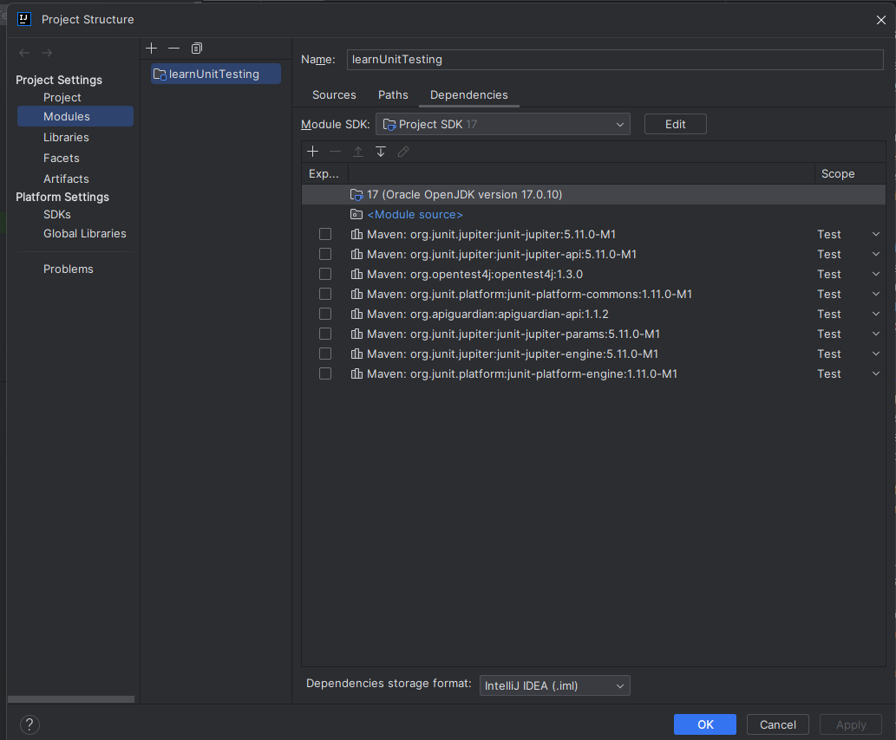
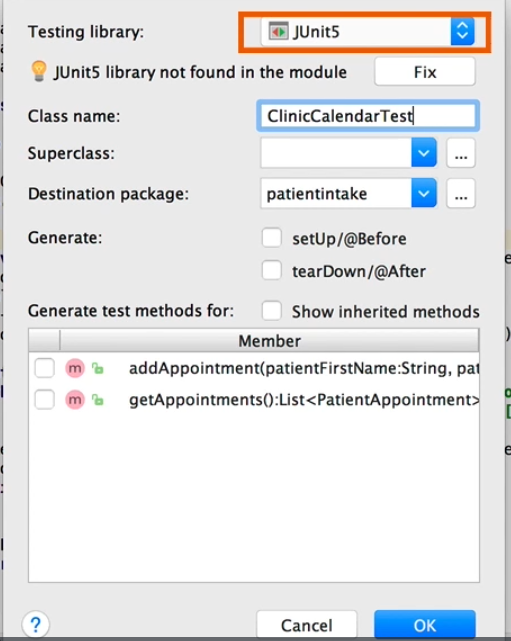
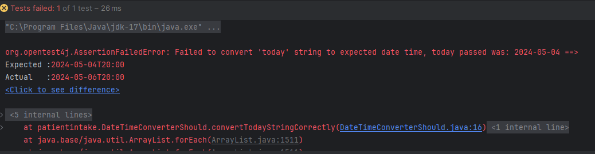

###  Benefits of Unit Testing

Unit tests are code that execute target code which is the code that is being tested
Unit tests check to see if the target code does what it is supposed to do.
Unit testing focuses on testing individual pieces of code in isolation from the rest of the software.


_Provides quick feedback_
Unit tests allow us to test a small part of code and ensure that it will work even though there may be other components that depend on the target code we are testing.
This is essential as a lot of times, software is built by different people simultaneously and by testing small pieces of code, we get the quick feedback that allows us to make necessary adjustments as needed.

_Improve quality of code_
Unit testing helps us with the design of the code. It allows us to test how the code will be used within a program and ensures that it will be easy for other programmers to call it and use it in other parts of a system.
If a code is too hard to call and test then it probably will be difficult for other programmers to use and understand.
Unit testing helps us refactor such code so that it is easily understood and thus improving the quality of the entire system.

_Increase confidence in the code_
By performing unit tests we essentially confirm that the code will do what it is designed to do.
This allows to be confident in the fact that it will execute properly.
Having tests that will let you know if you will break something gives confidence to programmers to clean up confusing and messy code because we can check what the code will do before updating already existing systems.

_Help catch regressions_
unit tests provide automated regression checking in that we can run all the tests needed to make sure the program runs efficiently before deploying it to end users.

_Serves as documentation_
Unit tests serve as documentation for ourselves and other programmers because we are able to see what a piece of code does and how it is used.

Component Tests vs Unit Tests
Component testing evaluates the behavior of the program without considering the details of the underlying code.
A component is made up of many units
Component testing can be used for testing a class with methods that call methods from other class
Component tests exercise target code in several classes at once.

Right-click on project folder
Select "Open module settings"

This dialogue box shows the project structure as well as the dependencies needed for unit testing in the form of JAR files.
This section would be empty if the dependencies have not been loaded onto the IDE yet.


The easiest way to download the dependencies is to generate a test

In this dialogue box, we can simply clock "Fix" and the IDE will download all of the necessary JAR files for use in unit testing.

```
package patientintake;

import org.junit.jupiter.api.Test;
import static org.junit.jupiter.api.Assertions.*;


class ClinicCalendarShould {
    @Test
    public void allowEntryOfAnAppointment(){
        
    }


}
```
The @Test annotation indicates to JUnit that this is a test it should execute.
Unit tests use the pattern set up-execute-verify to check that code is doing what it is supposed to do.

```
package patientintake;

import org.junit.jupiter.api.Test;

import java.time.format.DateTimeFormatter;
import java.util.List;
import static org.junit.jupiter.api.Assertions.*;


class ClinicCalendarShould {
    @Test
    public void allowEntryOfAnAppointment(){
        ClinicCalendar calendar = new ClinicCalendar();
        calendar.addAppointment("Lu", "Young", "murphy", "5/6/2024 3:15 pm");
        List<PatientAppointment>appointments = calendar.getAppointments();
        assertNotNull(appointments);
        assertEquals(1, appointments.size());
        PatientAppointment actualAppointment = appointments.get(0);
        assertEquals("Lu", actualAppointment.getPatientFirstName());
        assertEquals("Young", actualAppointment.getPatientLastName());
        assertEquals(Doctor.murphy, actualAppointment.getDoctor());
        assertEquals("5/6/2024 3:15 PM", actualAppointment.getAppointmentDateTime().format(DateTimeFormatter.ofPattern("M/d/yyyy h:mm a")));

    }
    //this test is a component test as it checks code from other classes
    //unit testing involves chicking that every component within the target code works as it should
    //assertEquals checks that the parameter on the left(expected) matches the parameter on the right(actual)
    //assertSame checks that two references are referring to the same object in memory
    //assertNotSame checks that an object that was supposed to have been coppied is not the same instance as the original it was coppied from
    
    
    //the most commo assertions used are assertEquals, assertTrue, assertFalse
    
```

###   Writing more complex tests.
When we use assertEquals to check collections, JUnit checks that the two collections contain equivalent objects and that these objects are in the same order in both collections.

We can use a collection-specific assertion **_assertIterableEquals()_**
An iterable in Java returns a series of objects that can be used in a for loop.
When comparing collections of different types, if we can get an iterable out of both of them then we can use the JUnit assertIterable to compare them.

###   Setting up and Tearing down Tests
JUnit provides annotations that we can use to show the lifecycle of a test
**@BeforeAll**
this runs once before all the test methods in the test class run

**@BeforeEach**
This runs once before each test method in the test class runs

**@AfterEach**
This will run once after each test method in the test class runs

**@AfterAll**
This will run once after all the test methods in the class have completed.

@BeforeAll and @AfterAll are class level and therefore static

These are the lifecycle annotations for tests


###  Custom Test Messages.
We can add in a third parameter in our assertions which is usually a message.
This gets displayed when we encounter an error.
We can utilize this option when we encounter test failures with messages we find difficult to understand.
By customising the error message, we can see where exactly the test failed and why.


We can also use the **@DisplayName()** annotation to customize the class and test names displayed when we run tests.
This can help us to read tests easier.